---
## Author
author:
  name: Люкшина Влада Алексеевна
  email: 112243022@pfur.ru
  affiliation:
    - name: Российский университет дружбы народов
      country: Российская Федерация
      postal-code: 117198
      city: Москва
      address: ул. Миклухо-Маклая, д. 6
## Title
title: Лабораторная работа №3
subtitle: Настройка прав доступа
date: today
date-format: "YYYY-MM-DD" # Example: 2025-09-06
---

## Цель работы

- Получение навыков настройки базовых и специальных прав доступа для групп пользо-
вателей в операционной системе типа Linux.

## Задание

- Прочитайте справочное описание man по командам chgrp, chmod, getfacl, setfacl. Выполните действия по управлению базовыми разрешениями для групп пользовате-
лей (раздел 3.3.1). Выполните действия по управлению специальными разрешениями для групп пользо-
вателей (раздел 3.3.2). Выполните действия по управлению расширенными разрешениями с использованием
списков ACL для групп пользователей (раздел 3.3.3).

## Выполнение лабораторной работы
## Выполнение
- Открываем терминал с учётной записью root, создаем каталоги. С помощью команды ls -Al смотрим, кто является владельцем этих каталогов.  
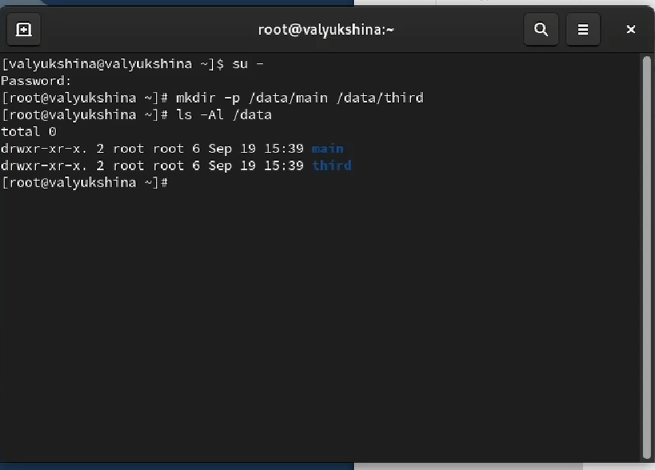

## Выполнение
- Изменяем владельцев этих каталогов с root на main и third соответственно. Проверяем, кто теперь является владельцем этих каталогов.  
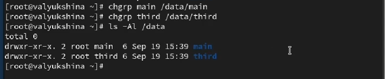

## Выполнение
- Устанавливаем разрешения, позволяющие владельцам каталогов записывать файлы в эти каталоги и запрещающие доступ к содержимому каталогов всем другим пользователям и группам. Проверяем успешность команды с помощью ls -Al.  
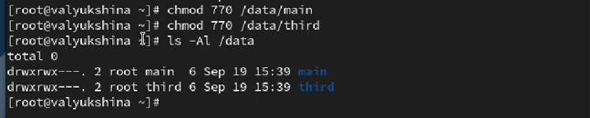

## Выполнение
- В другом терминале переходим под учётную запись пользователя bob и пробуем перейти в каталог /data/main и создать файл emptyfile в этом каталоге. Проверяем, кто является владельцем файла. Боб является участником группы, поэтому создание файла прошло успешно.  
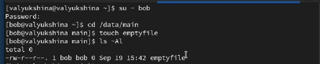

## Выполнение
- Пробуем перейти в каталог /data/third и создать файл emptyfile в этом каталоге. Боб не состоит в этой группе, у него нет прав на создание, поэтому файл создать не можем.  
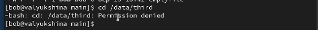

## Выполнение
- Открываем новый терминал под пользователем alice и переходим в каталог /data/main. Создаем два файла, владельцем которых является alice.  
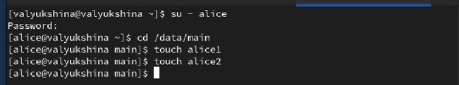

## Выполнение
- В другом терминале переходим под учётную запись пользователя bob и переходим в каталог /data/main. Просматриваем файлы и узнаем кто является пользователем и у кого есть все разрешения. Удаляем файлы alice.  
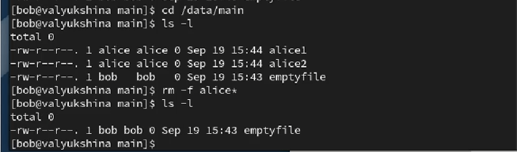

## Выполнение
- Создаем два файла, которые принадлежат пользователю bob.  
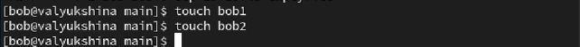

## Выполнение
- В терминале под пользователем root устанавливаем для каталога /data/main бит идентификатора группы, а также stiky-бит для разделяемого (общего) каталога группы.  

## Выполнение
- В терминале под пользователем alice создаем в каталоге /data/main файлы alice3 и alice4. Пробуем удалить файлы, принадлежащие пользователю bob. Видим, что sticky-bit предотвращает удаление этих файлов пользователем alice, поскольку этот пользователь не является владельцем этих файлов.  
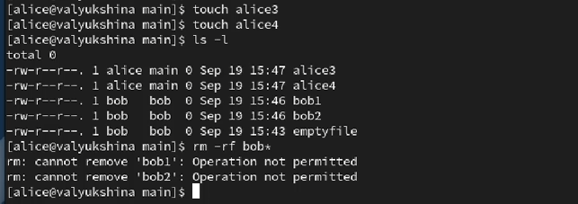

## Выполнение
- Открываем терминал с учётной записью root устанавливаем права на чтение и выполнение в каталоге /data/main для группы third и права на чтение и выполнение для группы main в каталоге /data/third.  
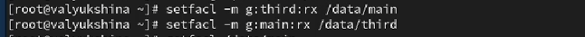

## Выполнение
- Используем команду getfacl, чтобы убедиться в правильности установки разрешений.  
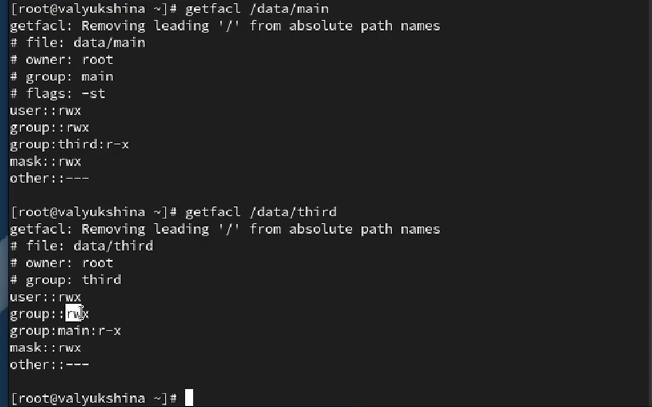

##Выполнение
- Создаем новый файл с именем newfile1 в каталоге /data/main. Используем getfacl для проверки текущих назначений полномочий.  
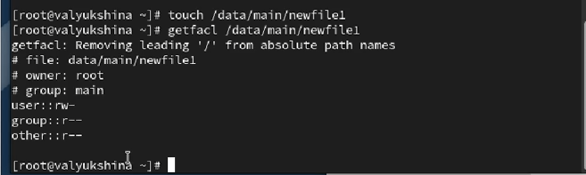

## Выполнение
- Выполняем аналогичные действия для каталога /data/third.  
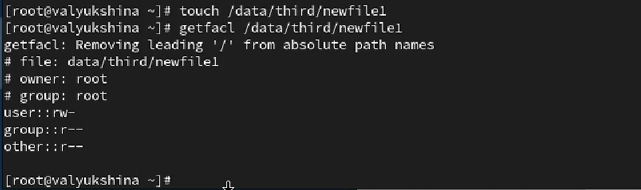

## Выполнение
- Устанавливаем ACL по умолчанию для каталогов /data/main и /data/third.  
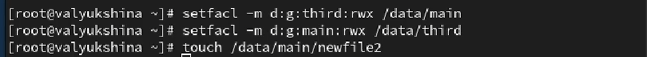

## Выполнение
- Добавим новый файл в каталог /data/main, чтобы убедиться, что настройки ACL работают. Используем getfacl.  
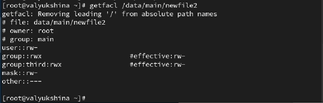

## Выполнение
- Выполним аналогичные действия для каталога /data/third.  
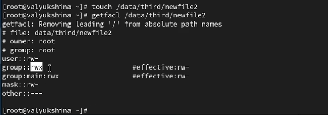

## Выполнение
- Для проверки полномочий группы third в каталоге /data/third войдем в другом терминале под учётной записью carol. Проверим операции с файлами и возможность осуществить запись в файл.
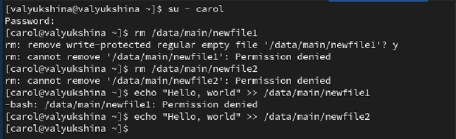

## Выводы

- В лабораторной работе №3 мы научились работать с правами доступа, используя несколько учетных записей, принадлежащих к разным группам.
