---
## Author
author:
  name: Люкшина Влада Алексеевна
  email: 1132243022@pfur.ru
  affiliation:
    - name: Российский университет дружбы народов
      country: Российская Федерация
      postal-code: 117198
      city: Москва
      address: ул. Миклухо-Маклая, д. 6

## Title
title: "Лабораторная работа № 3"
subtitle: "Настройка прав доступа"
---

# Цель работы

Получение навыков настройки базовых и специальных прав доступа для групп пользо-
вателей в операционной системе типа Linux.

# Задание

1. Прочитайте справочное описание man по командам chgrp, chmod, getfacl, setfacl.
2. Выполните действия по управлению базовыми разрешениями для групп пользовате-
лей (раздел 3.3.1).
3. Выполните действия по управлению специальными разрешениями для групп пользо-
вателей (раздел 3.3.2).
4. Выполните действия по управлению расширенными разрешениями с использованием
списков ACL для групп пользователей (раздел 3.3.3).

# Выполнение лабораторной работы

Открываем терминал с учётной записью root, создаем каталоги. С помощью команды ls -Al смотрим, кто является владельцем этих каталогов.  
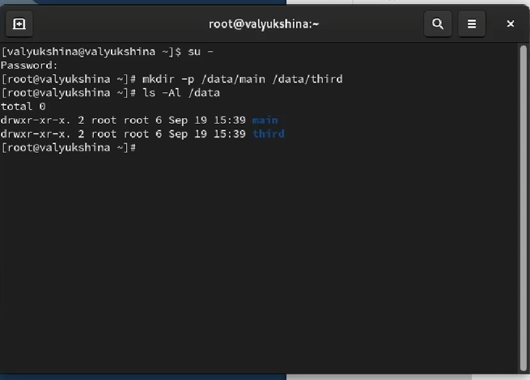

Изменяем владельцев этих каталогов с root на main и third соответственно. Проверяем, кто теперь является владельцем этих каталогов.  
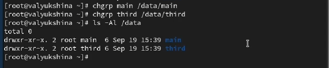

Устанавливаем разрешения, позволяющие владельцам каталогов записывать файлы в эти каталоги и запрещающие доступ к содержимому каталогов всем другим пользователям и группам. Проверяем успешность команды с помощью ls -Al.  
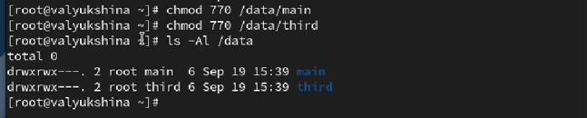

В другом терминале переходим под учётную запись пользователя bob и пробуем перейти в каталог /data/main и создать файл emptyfile в этом каталоге. Проверяем, кто является владельцем файла. Боб является участником группы, поэтому создание файла прошло успешно.  
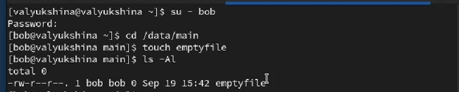

Пробуем перейти в каталог /data/third и создать файл emptyfile в этом каталоге. Боб не состоит в этой группе, у него нет прав на создание, поэтому файл создать не можем.  
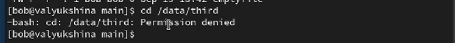

Открываем новый терминал под пользователем alice и переходим в каталог /data/main. Создаем два файла, владельцем которых является alice.  
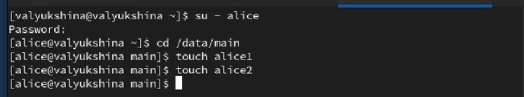

В другом терминале переходим под учётную запись пользователя bob и переходим в каталог /data/main. Просматриваем файлы и узнаем кто является пользователем и у кого есть все разрешения. Удаляем файлы alice.  
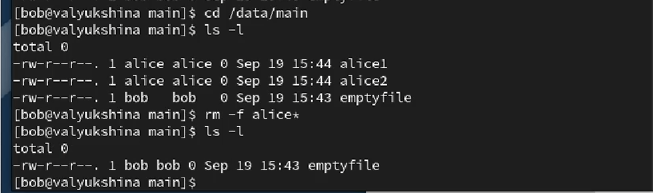

Создаем два файла, которые принадлежат пользователю bob.  
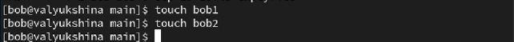

В терминале под пользователем root устанавливаем для каталога /data/main бит идентификатора группы, а также stiky-бит для разделяемого (общего) каталога группы.  

В терминале под пользователем alice создаем в каталоге /data/main файлы alice3 и alice4. Пробуем удалить файлы, принадлежащие пользователю bob. Видим, что sticky-bit предотвращает удаление этих файлов пользователем alice,
поскольку этот пользователь не является владельцем этих файлов.  
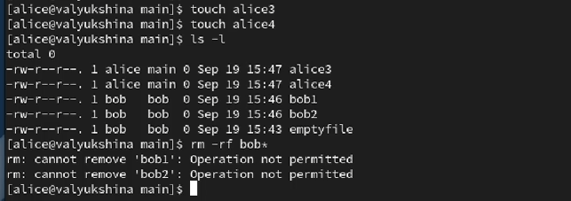

Открываем терминал с учётной записью root устанавливаем права на чтение и выполнение в каталоге /data/main для группы third и права на чтение и выполнение для группы main в каталоге /data/third.  
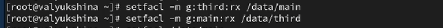

Используем команду getfacl, чтобы убедиться в правильности установки разрешений.  
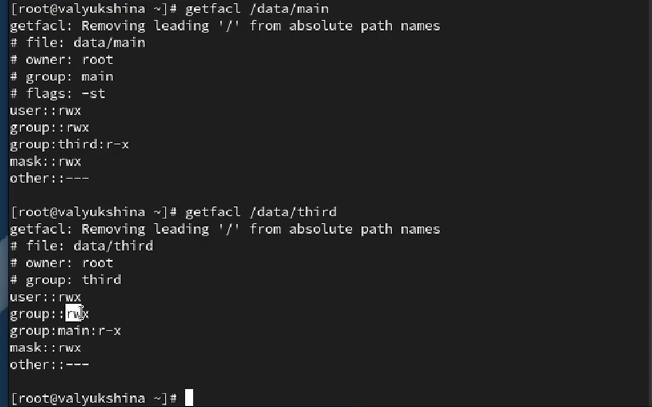

Создаем новый файл с именем newfile1 в каталоге /data/main. Используем getfacl для проверки текущих назначений полномочий.  
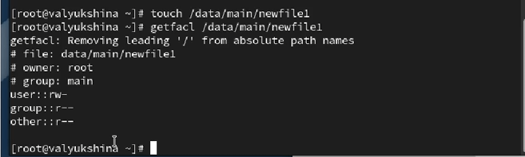

Выполняем аналогичные действия для каталога /data/third.  
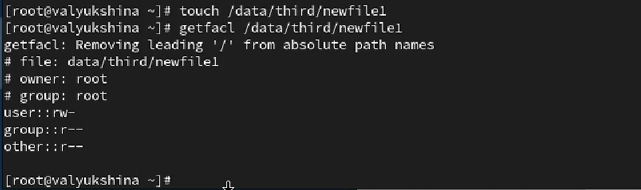

Устанавливаем ACL по умолчанию для каталогов /data/main и /data/third.  
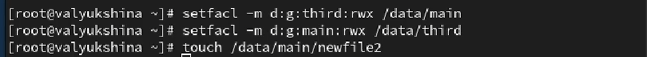

Добавим новый файл в каталог /data/main, чтобы убедиться, что настройки ACL работают. Используем getfacl.  
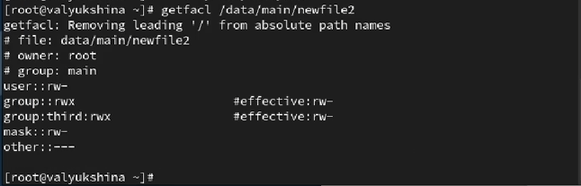

Выполним аналогичные действия для каталога /data/third.  
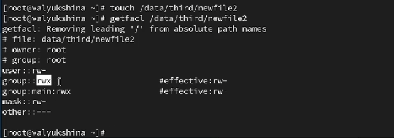

Для проверки полномочий группы third в каталоге /data/third войдем в другом терминале под учётной записью carol. Проверим операции с файлами и возможность осуществить запись в файл.
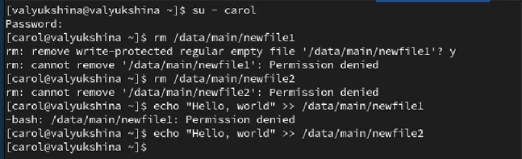

# Выводы

В лабораторной работе №3 мы научились работать с правами доступа, используя несколько учетных записей, принадлежащих к разным группам.

# Ответы на контрольные вопросы

1. Установка владельца группы для файла  
bash  
chown :groupname filename  

2. Поиск файлов по пользователю  
bash  
find /path/to/search -user username  
Пример:  
find /home -user bob  

3. Установка прав для каталога /data  
bash  
chmod -R u=rwx,g=rwx,o= /data  

4. Добавление разрешения на выполнение  
bash  

chmod u+x filename    # для владельца  
chmod g+x filename    # для группы  
chmod o+x filename    # для других  
Пример:  
chmod +x script.sh  

5. Установка SGID бита для наследования группы  
bash  
chmod g+s directory  
Пример:  
chmod g+s /shared_directory  
Проверка:  
ls -ld /shared_directory  

6. Ограничение удаления файлов (sticky bit)  
bash  
chmod +t directory  
Пример   
chmod 1777 /shared_folder  

7. Добавление ACL для группы  
bash  
setfacl -m g:groupname:r *  

Проверка:  
getfacl filename  

8. Рекурсивное ACL для текущего и будущих файлов  
bash  
 Для существующих файлов:  
setfacl -R -m g:groupname:r .  
 Для наследования прав на будущие файлы:  
setfacl -R -d -m g:groupname:r .  
Пример:  
setfacl -R -m g:readers:r .  
setfacl -R -d -m g:readers:r .  

9. Umask для запрета прав "другим"  
bash  
umask 007  

Пример:  
echo "umask 007" >> ~/.bashrc  
source ~/.bashrc  
  
Проверка:  
umask  

10. Защита файла от случайного удаления  
bash  
chattr +i myfile  
Пример:  
sudo chattr +i important_file.txt  

