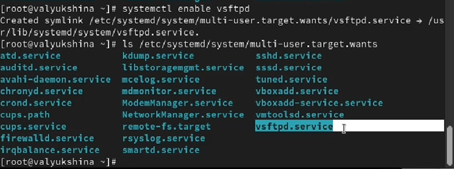
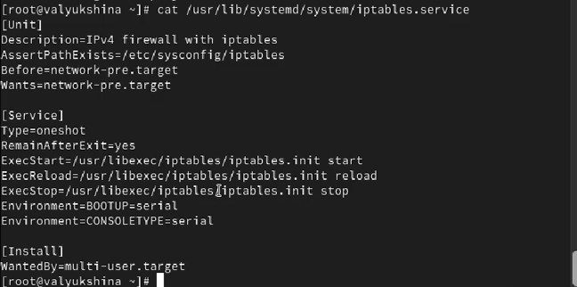

---
## Author
author:
  name: Люкшина Влада Алексеевна
  email: 1132243022@pfur.ru
  affiliation:
    - name: Российский университет дружбы народов
      country: Российская Федерация
      postal-code: 117198
      city: Москва
      address: ул. Миклухо-Маклая, д. 6

## Title
title: "Лабораторная работа № 5"
subtitle: "Управление системными службами"
---

# Цель работы

Получение навыков управления системными службами операционной системы посредством systemd.

# Задание

1. Выполните основные операции по запуску (останову), определению статуса, добавлению (удалению) в автозапуск и пр. службы Very Secure FTP.
2. Продемонстрируйте навыки по разрешению конфликтов юнитов для служб firewalld и iptables.
3. Продемонстрируйте навыки работы с изолированными целями.

# Выполнение лабораторной работы

Получаем полномочия администратора и проверяем статус службы Very Secure FTP. Так как служба Very Secure FTP не установлена, сервис в настоящее время отключён.  

Устанавливаем службу Very Secure FTP.  

Запустим службу Very Secure FTP и проверим ее статус. Видим, что служба в настоящее время работает, но не будет активирована при перезапуске операционной системы.  

Добавим службу Very Secure FTP в автозапуск при загрузке операционной системы. Затем проверим статус службы.  

Удалим службу из автозапуска, используя команду systemctl disable, и снова проверим её статус.  

Выведем на экран символические ссылки, ответственные за запуск различных сервисов. Увидим, что ссылки на vsftpd.service не существует.  

Снова добавим службу Very Secure FTP в автозапуск и выведем на экран символические ссылки, ответственные за запуск различных сервисов. Заметим, что создана символическая ссылка.  

Снова проверим статус службы Very Secure FTP. Увидим, что для файла юнита состояние изменено с disabled на enabled.  

Выведем на экран список зависимостей юнита.  

Выведем на экран список юнитов, которые зависят от данного юнита.  

Установим iptables.  

Проверим статус firewalld.  

Проверим статус iptables.  

Попробуем запустить firewalld и iptables. Увидим, что при запуске одной службы вторая не запускается.  

Выведем настройки конфликтов для первого юнита.  

Выведем настройки конфликтов для второго юнита.  

Выгрузим службу iptables и проверим ее статус.  

Загрузим службу firewalld.  

Заблокируем запуск iptables. Заметим, что создалась символическая ссылка на /dev/null для iptables.service.  Это сделает невозможным случайный запуск сервиса iptables. Попробуем запустить iptables. Видим, что появилось сообщение об ошибке. Попробуем добавить iptables в автозапуск. Сервис будет неактивен, а статус загрузки отобразится как замаскированный.  

Перейдем в каталог systemd и найдем список всех целей, которые можно изолировать.  

Переключим операционную систему в режим восстановления, введем пароль root на консоли сервера для входа в систему и корректно перезапустим операционную систему.  

Выведем на экран цель, установленную по умолчанию. Установим для запуска по умолчанию текстовый режим.  

Перегрузим систему командой reboot. Убедимся, что система загрузилась в текстовом режиме. Получите полномочия администратора и установим запуск по умолчанию в графическом режиме.  

Вновь перегрузим систему и убедимся, что система загрузилась в графическом режиме.  

# Выводы

В лабораторной работе №5 мы научились работать с системными службами операционной системы посредством systemd.  

# Ответы на контрольные вопросы

1. Что такое юнит (unit)? Приведите примеры.  
Юнит — это базовый объект управления в systemd, который представляет собой системный ресурс или службу. Юниты определяются в конфигурационных файлах и могут быть разных типов.  

Основные типы юнитов:  

Сервис (service): nginx.service, ssh.service  

Сокет (socket): sshd.socket — активация служб по сетевому соединению  

Цель (target): multi-user.target, graphical.target — группы юнитов (аналоги уровней запуска)  

2. Какая команда позволяет убедиться, что цель больше не входит в список автоматического запуска?  

3. Какую команду использовать для отображения всех загруженных сервисных юнитов?  

4. Как создать потребность (wants) в сервисе?  

5. Как переключить текущее состояние на цель восстановления (rescue target)?  

6. Причина получения сообщения о том, что цель не может быть изолирована  
Основные причины:  
Циклические зависимости между юнитами  
Отсутствуют альтернативы для критически важных служб  
Жесткие зависимости (Requires вместо Wants)  
Конфликтующие юниты, которые нельзя остановить одновременно  

7. Какая команда покажет зависимости от службы?  

