---
## Author
author:
  name: Люкшина Влада Алексеевна
  email: 112243022@pfur.ru
  affiliation:
    - name: Российский университет дружбы народов
      country: Российская Федерация
      postal-code: 117198
      city: Москва
      address: ул. Миклухо-Маклая, д. 6
## Title
title: Лабораторная работа №6
subtitle: Управление процессами
date: today
date-format: "YYYY-MM-DD" # Example: 2025-09-06
---

## Цель работы

- Получить навыки управления процессами операционной системы.  

## Задание

- Продемонстрируйте навыки управления заданиями операционной системы. Продемонстрируйте навыки управления процессами операционной системы. Выполните задания для самостоятельной работы.  

## Выполнение лабораторной работы
## Выполнение
- Получим полномочия администратора и введем следующие команды, запускающие процесс.  
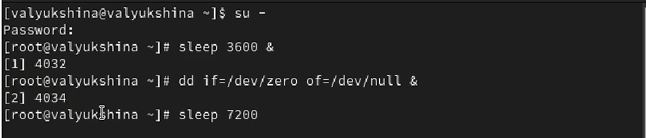

## Выполнение
- Поскольку мы запустили последнюю команду без & после неё, у нас есть 2 часа, прежде чем мы снова получим контроль над оболочкой. Введем Ctrl + z , чтобы остановить процесс.  

## Выполнение
- Введем команду jobs и увидим три задания, которые мы только что запустили. Первые два имеют состояние Running, а последнее задание в настоящее время находится в состоянии Stopped.  
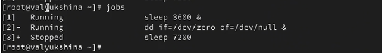

## Выполнение
- Для продолжения выполнения задания 3 в фоновом режиме введем команду bg 3. С помощью команды jobs посмотрим изменения в статусе заданий. Как мы видим, теперь 3 задание поменяло статус на Running и выполняется в фоновом режиме.  
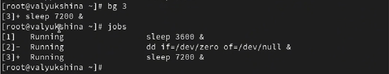

## Выполнение
- Для перемещения задания 1 на передний план введем команду fg 1. Введите Ctrl + c , чтобы отменить задание 1. Проделаем то же самое для отмены заданий 2 и 3.  
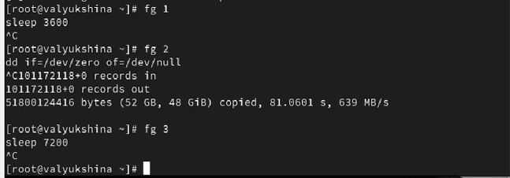

## Выполнение
- Откроем второй терминал и под учётной записью своего пользователя введем в него команду: dd if=/dev/zero of=/dev/null &. Введите exit, чтобы закрыть второй терминал.  
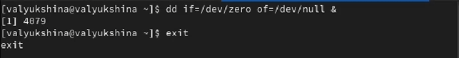

## Выполнение
- На другом терминале под учётной записью своего пользователя запустим top. Мы увидим, что задание dd всё ещё запущено. Для выхода из top используем q.  
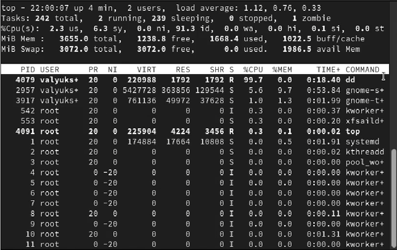

## Выполнение
- Вновь запустим top и в нём используем k (команда kill), чтобы убить задание dd. После этого выйдем из top.  

## Выполнение
- Введем следующую команду три раза: dd if=/dev/zero of=/dev/null &. Я буду вводить два раза, так как больше 2-ух процессов одновременно невозможно запустить, иначе rocky перестает работать. Вводим ps aux | grep dd. 
Эта команда показывает все строки, в которых есть буквы dd. Запущенные процессы dd идут последними.  

## Выполнение
- Используем PID одного из процессов dd, чтобы изменить приоритет. Используем команду renice -n 5 <PID>.  
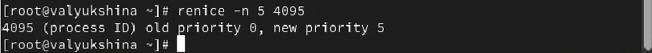

## Выполнение
- Введем команду ps fax | grep -B5 dd. Параметр -B5 показывает соответствующие запросу строки, включая пять строк до этого. Поскольку ps fax показывает иерархию отношений между процессами, мы также увидим оболочку, из которой были запущены все процессы dd, и её PID.  

## Выполнение
- Найдем PID корневой оболочки, из которой были запущены процессы dd, и введем команду kill -9 <PID>. Мы увидим, что корневая оболочка закрылась, а вместе с ней и все процессы dd.  
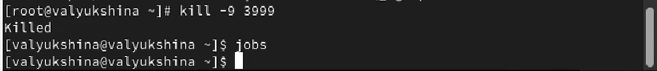

## Выполнение самостоятельной работы
## Задание 1
- Запустим команду dd if=/dev/zero of=/dev/null трижды как фоновое задание. Увеличим приоритет первой команды, используя значение приоритета −5.  

## Задание 1
- Изменим приоритет того же процесса ещё раз, но используем на этот раз значение −15. Как мы видим, приоритет не прибавился, а обновился.  
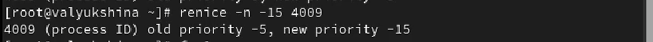

## Задание 1
- Завершим все процессы dd, которые мы запустили.  
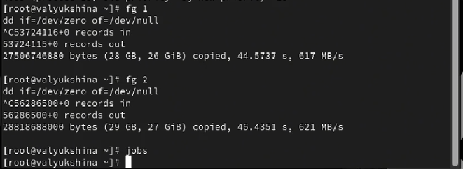

## Задание 2
- Запустим программу yes в фоновом режиме с подавлением потока вывода.  
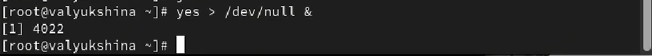

## Задание 2
- Запустим программу yes на переднем плане с подавлением потока вывода. Приостановим выполнение программы. Заново запустим программу yes с теми же параметрами, затем завершим её выполнение.  

## Задание 2
- Запустим программу yes на переднем плане без подавления потока вывода. Приостановим выполнение программы.  

## Задание 2
- Заново запустим программу yes с теми же параметрами, затем завершим её выполнение.  
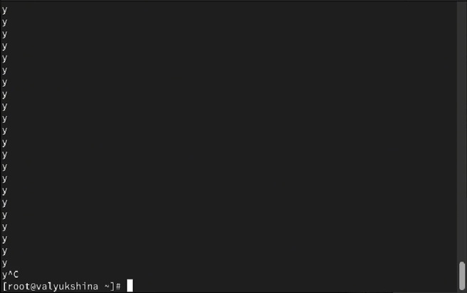

## Задание 2
- Проверим состояния заданий, воспользовавшись командой jobs.  

## Задание 2
- Переведем процесс, который выполняется в фоновом режиме, на передний план, затем остановим его.  
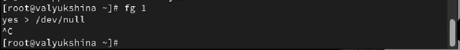

## Задание 2
- Переведем процесс с подавлением потока вывода в фоновый режим. Проверим состояния заданий, воспользовавшись командой jobs. Обратим внимание, что процесс стал выполняющимся (Running) в фоновом режиме.  

## Задание 2
- Запустим процесс в фоновом режиме таким образом, чтобы он продолжил свою работу даже после отключения от терминала. Выйдем из терминала и убедимся, что процесс продолжил свою работу.  
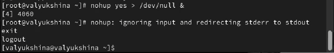

## Задание 2
- Получим информацию о запущенных в операционной системе процессах с помощью утилиты top.  
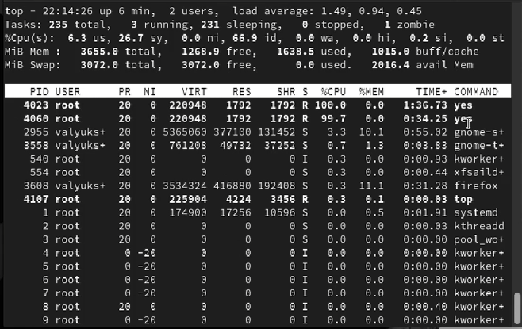

## Задание 2
- Запустиv ещё две программы yes в фоновом режиме с подавлением потока вывода. Убьем два процесса: для одного используем его PID, а для другого — его идентификатор конкретного задания.  
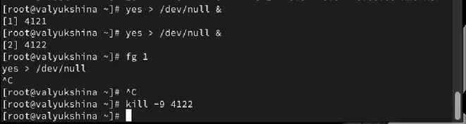

## Задание 2
- Запустим еще одну программу в фоновм режиме.  

## Задание 2
- Попробуем послать сигнал 1 (SIGHUP) процессу, запущенному с помощью nohup, и обычному процессу.  
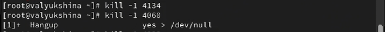

## Задание 2
- Запустим ещё несколько программ yes в фоновом режиме с подавлением потока вывода и завершим их работу одновременно, используя команду killall.  
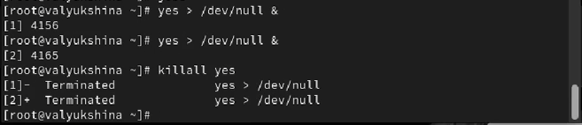

## Задание 2
- Запустим программу yes в фоновом режиме с подавлением потока вывода. Используем утилиту nice, запустим программу yes с теми же параметрами и с приоритетом, большим на 5. Сравним абсолютные и относительные приоритеты у этих двух процессов.  
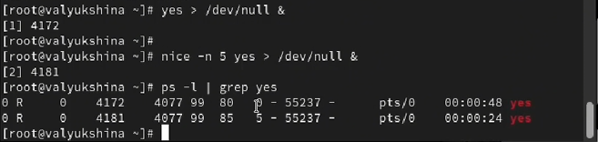

## Задание 2
- Используя утилиту renice, изменим приоритет у одного из потоков yes таким образом, чтобы у обоих потоков приоритеты были равны. Изменим приоритет второго процесса на -5, чтобы приоритет процессов был равен.  
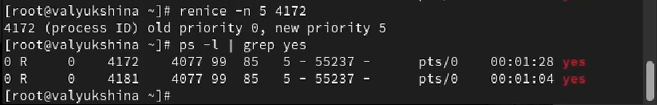

## Выводы

- В лабораторной работе №6 мы научились работать с процессами, останавливая и отменяя их, а так же меняя приоритет выполнения.  
