---
## Author
author:
  name: Люкшина Влада Алексеевна
  email: 112243022@pfur.ru
  affiliation:
    - name: Российский университет дружбы народов
      country: Российская Федерация
      postal-code: 117198
      city: Москва
      address: ул. Миклухо-Маклая, д. 6
## Title
title: Лабораторная работа №7
subtitle: Управление журналами событий в системе
date: today
date-format: "YYYY-MM-DD" # Example: 2025-09-06
---

## Цель работы

- Получить навыки работы с журналами мониторинга различных событий в системе.  

## Задание

- Продемонстрируйте навыки работы с журналом мониторинга событий в реальном времени. Продемонстрируйте навыки создания и настройки отдельного файла конфигурации мониторинга отслеживания событий веб-службы. Продемонстрируйте навыки работы с journalctl. Продемонстрируйте навыки работы с journald.  

## Выполнение лабораторной работы
## Выполнение
- Запускаем три вкладки терминала и в каждом из них получаем полномочия администратора.  
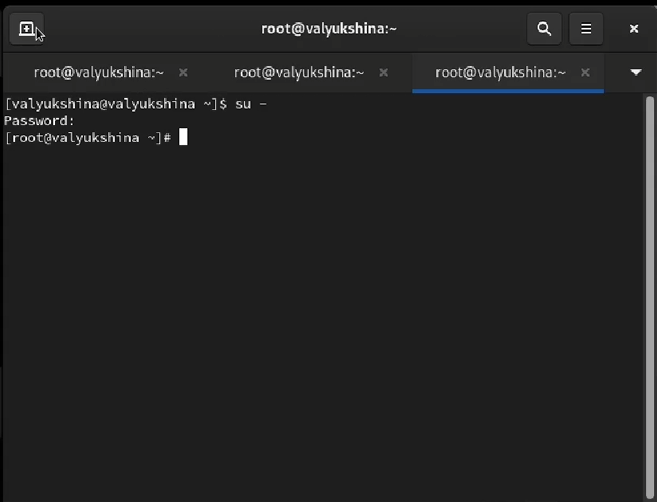

## Выполнение
- На второй вкладке терминала запускаем мониторинг системных событий в реальном времени.  

## Выполнение
- В третьей вкладке терминала вернемся к учётной записи своего пользователя и попробуем получить полномочия администратора, но введем неправильный пароль.  
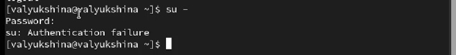

## Выполнение
- Заметим также, что во второй вкладке терминала
с мониторингом событий появится сообщение «FAILED
SU (to root)». Отображаемые на экране сообщения также фиксируются в файле /var/log/messages.  

## Выполнение
- В третьей вкладке терминала из оболочки пользователя введем logger hello.  

## Выполнение
- Во второй вкладке терминала с мониторингом событий мы видим сообщение hello.  

## Выполнение
- Во второй вкладке терминала с мониторингом остановим трассировку файла сообщений мониторинга реального времени, используя Ctrl + c . Затем запустим мониторинг сообщений безопасности (последние 20 строк соответствующего файла логов). Мы увидим сообщения, которые ранее были зафиксированы во время ошибки авторизации при вводе команды su.  

## Выполнение
- В первой вкладке терминала установим Apach.  
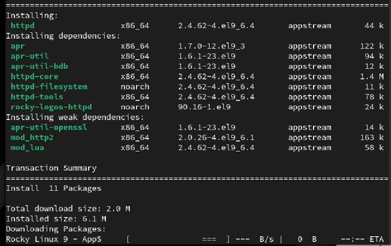

## Выполнение
- После окончания процесса установки запустим веб-службу.  
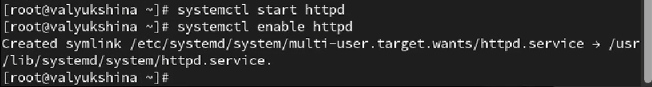

## Выполнение
- Во второй вкладке терминала посмотрим журнал сообщений об ошибках веб-службы, а затем закроем трассировку файла журнала.  

## Выполнение
- В третьей вкладке терминала получим полномочия администратора и в файле конфигурации /etc/httpd/conf/httpd.conf в конце добавим строку: ErrorLog syslog:local1.  

## Выполнение
- В каталоге /etc/rsyslog.d создадим файл мониторинга событий веб-службы.  
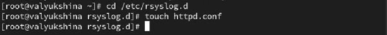

## Выполнение
- Откроем файл для редактирование и прописываем в нём следующую строку: local1.* -/var/log/httpd-error.log. 
Эта строка позволит отправлять все сообщения, получаемые для объекта local1 (который теперь используется службой httpd), в файл /var/log/httpd-error.log.  
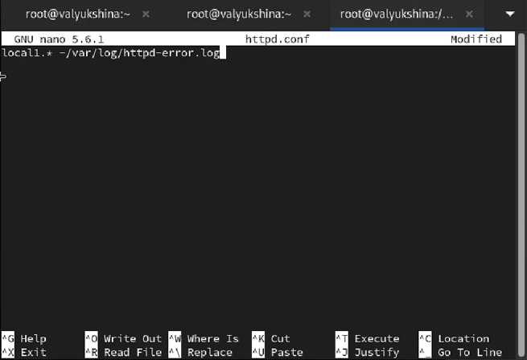

## Выполнение
- Перейдем в первую вкладку терминала и перезагрузим конфигурацию rsyslogd и веб-службу. Все сообщения об ошибках веб-службы теперь будут записаны в файл
/var/log/httpd-error.log.  

## Выполнение
- В третьей вкладке терминала создадим отдельный файл конфигурации для мониторинга отладочной информации. В этом же терминале введем следующую команду: echo "*.debug /var/log/messages-debug" > /etc/rsyslog.d/debug.conf.  
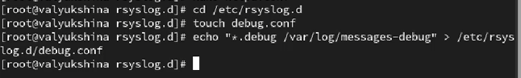

## Выполнение
- В первой вкладке терминала снова перезапустим rsyslogd.  

## Выполнение
- Во второй вкладке терминала запустим мониторинг отладочной информации.  

## Выполнение
- В третьей вкладке терминала введем: logger -p daemon.debug "Daemon Debug Message".  
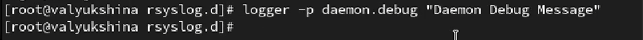

## Выполнение
- В терминале с мониторингом посмотрим сообщение отладки: Daemon Debug Message.  

## Выполнение
- Во второй вкладке терминала посмотрим содержимое журнала с событиями с момента последнего запуска системы.  
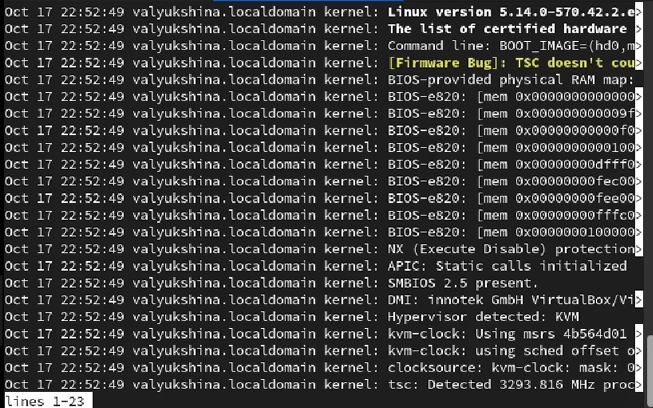

## Выполнение
- Просмотрим содержимое журнала без использования пейджера.  

## Выполнение
- Используем режим просмотра журнала в реальном времени.  

## Выполнение
- Для использования фильтрации просмотра конкретных параметров журнала введем journalctl и дважды нажмите клавишу Tab.  
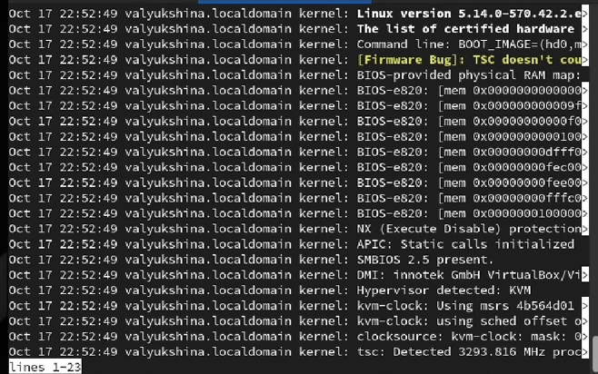

## Выполнение
- Просмотрим события для UID0.  

## Выполнение
- Просмотрим последние 20 строк журнала.  

## Выполнение
- Для просмотра только сообщений об ошибках введем команду journalctl -p err.  

## Выполнение
- Просмотрим только сообщений об ошибках.  
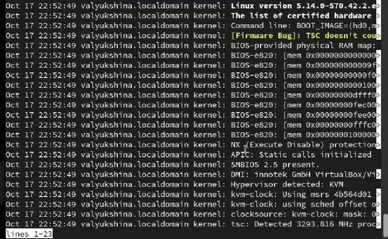

## Выполнение
- Просмотрим все сообщения с ошибкой приоритета, которые были зафиксированы со вчерашнего дня.  
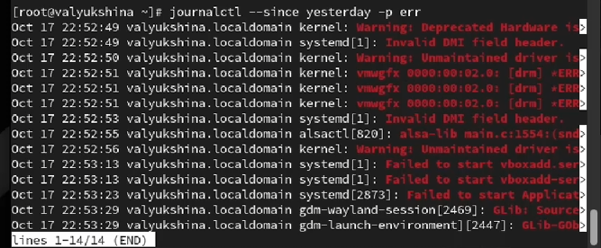

## Выполнение
- Просмотрим детальную информацию.  

## Выполнение
- Просмотрим дополнительную информацию о модуле sshd.  
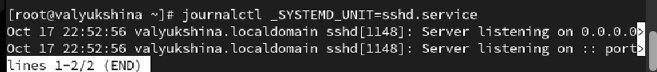

## Выполнение
- Запуститим новый терминал и получим полномочия администратора. Создадим каталог для хранения записей журнала. Скорректируем права доступа для каталога /var/log/journal, чтобы journald смог записывать в него информацию.  

## Выполнение
- Для принятия изменений используем команду: killall -USR1 systemd-journald.  

## Выполнение
- Просмотрим сообщения журнала с момента последней перезагрузки.  

## Выводы

- В лабораторной работе №7 мы научились управлять журналами событий в системе, устанавливать разные режимы отображения журнала.  
