---
## Author
author:
  name: Люкшина Влада Алексеевна
  email: 1132243022@pfur.ru
  affiliation:
    - name: Российский университет дружбы народов
      country: Российская Федерация
      postal-code: 117198
      city: Москва
      address: ул. Миклухо-Маклая, д. 6

## Title
title: "Лабораторная работа № 7"
subtitle: "Управление журналами событий в системе"
---

# Цель работы

Получить навыки работы с журналами мониторинга различных событий в системе.  

# Задание

1. Продемонстрируйте навыки работы с журналом мониторинга событий в реальном времени.  
2. Продемонстрируйте навыки создания и настройки отдельного файла конфигурации мониторинга отслеживания событий веб-службы.  
3. Продемонстрируйте навыки работы с journalctl.  
4. Продемонстрируйте навыки работы с journald.  

# Выполнение лабораторной работы
Запускаем три вкладки терминала и в каждом из них получаем полномочия администратора.  

На второй вкладке терминала запускаем мониторинг системных событий в реальном времени.  
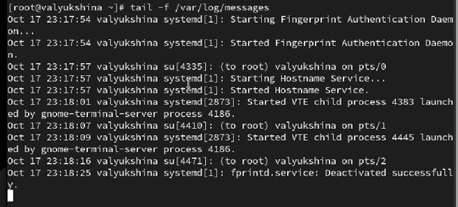

В третьей вкладке терминала вернемся к учётной записи своего пользователя и попробуем получить полномочия администратора, но введем неправильный пароль.  

Заметим также, что во второй вкладке терминала
с мониторингом событий появится сообщение «FAILED
SU (to root)». Отображаемые на экране сообщения также фиксируются в файле /var/log/messages.  

В третьей вкладке терминала из оболочки пользователя введем logger hello.  

Во второй вкладке терминала с мониторингом событий мы видим сообщение hello.  

Во второй вкладке терминала с мониторингом остановим трассировку файла сообщений мониторинга реального времени, используя Ctrl + c . Затем запустим мониторинг сообщений безопасности (последние 20 строк соответствующего файла логов). Мы увидим сообщения, которые ранее были зафиксированы во время ошибки авторизации при вводе команды su.  

В первой вкладке терминала установим Apach.  

После окончания процесса установки запустим веб-службу.  

Во второй вкладке терминала посмотрим журнал сообщений об ошибках веб-службы, а затем закроем трассировку файла журнала.  
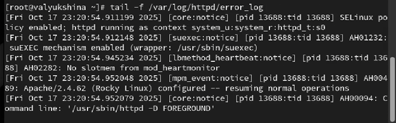

В третьей вкладке терминала получим полномочия администратора и в файле конфигурации /etc/httpd/conf/httpd.conf в конце добавим строку: ErrorLog syslog:local1.  
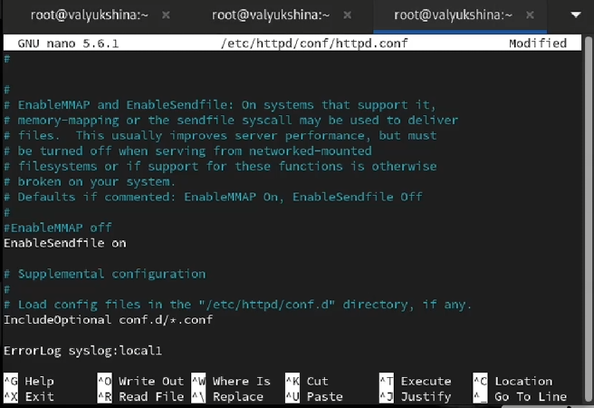

В каталоге /etc/rsyslog.d создадим файл мониторинга событий веб-службы.  

Откроем файл для редактирование и прописываем в нём следующую строку: local1.* -/var/log/httpd-error.log. 
Эта строка позволит отправлять все сообщения, получаемые для объекта local1 (который теперь используется службой httpd), в файл /var/log/httpd-error.log.  

Перейдем в первую вкладку терминала и перезагрузим конфигурацию rsyslogd и веб-службу. Все сообщения об ошибках веб-службы теперь будут записаны в файл
/var/log/httpd-error.log.  
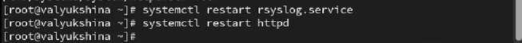

В третьей вкладке терминала создадим отдельный файл конфигурации для мониторинга отладочной информации. В этом же терминале введем следующую команду: echo "*.debug /var/log/messages-debug" > /etc/rsyslog.d/debug.conf.  

В первой вкладке терминала снова перезапустим rsyslogd.  

Во второй вкладке терминала запустим мониторинг отладочной информации.  
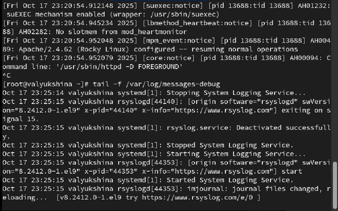

В третьей вкладке терминала введем: logger -p daemon.debug "Daemon Debug Message".  

В терминале с мониторингом посмотрим сообщение отладки: Daemon Debug Message.  

Во второй вкладке терминала посмотрим содержимое журнала с событиями с момента последнего запуска системы.  

Просмотрим содержимое журнала без использования пейджера.  

Используем режим просмотра журнала в реальном времени.  
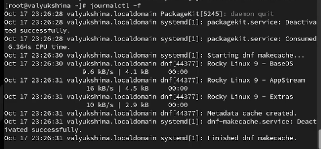

Для использования фильтрации просмотра конкретных параметров журнала введем journalctl и дважды нажмите клавишу Tab.  

Просмотрим события для UID0.  

Просмотрим последние 20 строк журнала.  

Для просмотра только сообщений об ошибках введем команду journalctl -p err.  
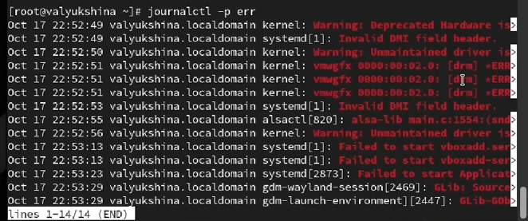

Просмотрим только сообщений об ошибках.  

Просмотрим все сообщения с ошибкой приоритета, которые были зафиксированы со вчерашнего дня.  

Просмотрим детальную информацию.  

Просмотрим дополнительную информацию о модуле sshd.  

Запуститим новый терминал и получим полномочия администратора. Создадим каталог для хранения записей журнала. Скорректируем права доступа для каталога /var/log/journal, чтобы journald смог записывать в него информацию.  
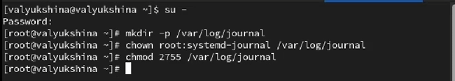

Для принятия изменений используем команду: killall -USR1 systemd-journald.  
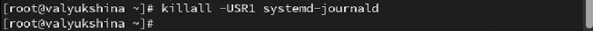

Просмотрим сообщения журнала с момента последней перезагрузки.  
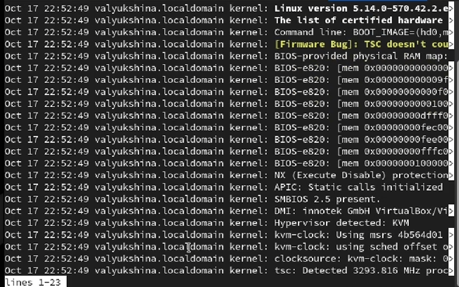

# Выводы

В лабораторной работе №7 мы научились управлять журналами событий в системе, устанавливать разные режимы отображения журнала.  

# Ответы на контрольные вопросы

1. Какой файл используется для настройки rsyslogd?  
Основной файл конфигурации:  
/etc/rsyslog.conf и файлы в каталоге /etc/rsyslog.d/  

2. В каком файле журнала rsyslogd содержатся сообщения, связанные с аутентификацией?  
/var/log/secure  

3. Если вы ничего не настроите, то сколько времени потребуется для ротации файлов журналов?  
По умолчанию в Rocky/RHEL используется еженедельная ротация (настраивается в /etc/logrotate.conf и конфигах в /etc/logrotate.d/, включая syslog).  

4. Какую строку следует добавить в конфигурацию для записи всех сообщений с приоритетом info в файл /var/log/messages.info?  
В rsyslog.conf:  
*.info /var/log/messages.info  

5. Какая команда позволяет вам видеть сообщения журнала в режиме реального времени?  
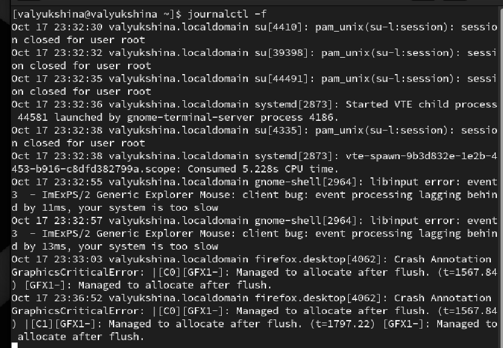

6. Какая команда позволяет вам видеть все сообщения журнала, которые были написаны для PID 1 между 9:00 и 15:00?  
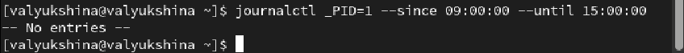

7. Какая команда позволяет вам видеть сообщения journald после последней перезагрузки системы?  
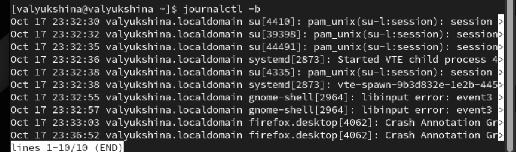

8. Какая процедура позволяет сделать журнал journald постоянным?  
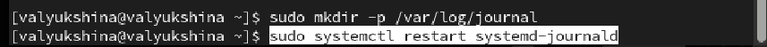

