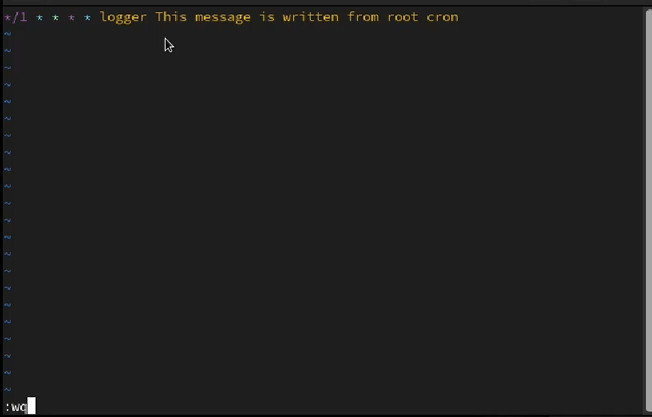
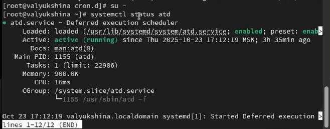
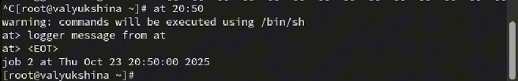
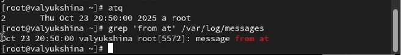

---
## Author
author:
  name: Люкшина Влада Алексеевна
  email: 112243022@pfur.ru
  affiliation:
    - name: Российский университет дружбы народов
      country: Российская Федерация
      postal-code: 117198
      city: Москва
      address: ул. Миклухо-Маклая, д. 6
## Title
title: Лабораторная работа №8
subtitle: Планировщики событий
date: today
date-format: "YYYY-MM-DD" # Example: 2025-09-06
---

## Цель работы

- Получение навыков работы с планировщиками событий cron и at.  

## Задание

- Выполните задания по планированию задач с помощью crond. Выполните задания по планированию задач с помощью atd.  

## Выполнение лабораторной работы
## Выполнение
- Запустим терминал и получим полномочия администратора. Посмотрим статус демона crond. Как мы видим, он запущен.  
!

## Выполнение
- Посмотрим содержимое файла конфигурации /etc/crontab.  
!

## Выполнение
- Посмотрим список заданий в расписании. Ничего не отобразилось, так как расписание ещё не задано.  
!

## Выполнение
- Откроем файл расписания на редактирование. Добавим следующую строку в файл расписания используя Ins для перехода в vi в режим ввода: */1 * * * * logger This message is written from root cron. Это сообщение будет выводиться каждую минуту. Закроем сеанс редактирования vi и сохраним изменения, используя команду vi: Esc : w q.  
!

## Выполнение
- Посмотрим список заданий в расписании. В расписании появилась запись о запланированном событии.  
!

## Выполнение
- Не выключая систему, через 3 минуты просмотрим журнал системных событий. Наше сообщение выводилось каждую минуту.  
!

## Выполнение
- Изменим запись в расписании crontab на следующую:
0 */1 * * 1-5 logger This message is written from root cron. Сообщение будет выводиться каждый час в ХХ:01.
!

## Выполнение
- Посмотрим список заданий в расписании.  
!

## Выполнение
- Перейдем в каталог /etc/cron.hourly и создадим в нём файл сценария с именем eachhour.  
!

## Выполнение
- Откроем файл eachhour для редактирования и пропишем в нём следующий скрипт: #!/bin/sh logger This message is written at $(date)  
!

## Выполнение
- Сделаем файл сценария eachhour исполняемым.  
!

## Выполнение
- Теперь перейдем в каталог /etc/crond.d и создадим в нём файл с расписанием eachhour.  
!

## Выполнение
- Откроем этот файл для редактирования и поместим в него следующее содержимое: 11 * * * * root logger This message is written from /etc/cron.d. Это сообщение будет выводиться каждый час в ХХ:11.  
!

## Выполнение
- Не выключая систему, через 3 часа просмотрим журнал системных событий.  
!

## Выполнение
- Проверим, что служба atd загружена и включена.  
!

## Выполнение
- Зададим выполнение команды logger message from at в 20:50. Затем введем "logger message from at" и закроем оболочку.  
!

## Выполнение
- Убедимся, что задание действительно запланировано и посмотрим, появилось ли соответствующее сообщение в лог-файле в указанное нами времяю.  
!

## Выводы

- В лабораторной работе №8 мы научились планировать задачи в системе, работать со списком задач и временными ограничениями задач.  
