---
## Author
author:
  name: Люкшина Влада Алексеевна
  email: 1132243022@pfur.ru
  affiliation:
    - name: Российский университет дружбы народов
      country: Российская Федерация
      postal-code: 117198
      city: Москва
      address: ул. Миклухо-Маклая, д. 6

## Title
title: "Лабораторная работа № 8"
subtitle: "Планировщики событий"
---

# Цель работы

Получение навыков работы с планировщиками событий cron и at.  

# Задание

1. Выполните задания по планированию задач с помощью crond.  
2. Выполните задания по планированию задач с помощью atd.  

# Выполнение лабораторной работы
Запустим терминал и получим полномочия администратора. Посмотрим статус демона crond. Как мы видим, он запущен.  
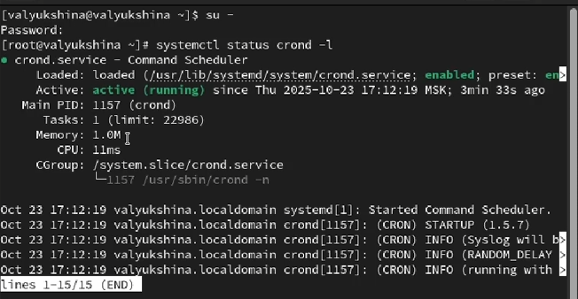!

Посмотрим содержимое файла конфигурации /etc/crontab.  
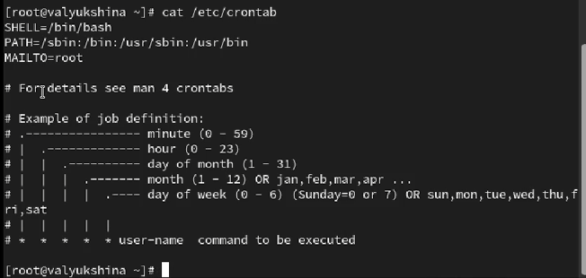!

Посмотрим список заданий в расписании. Ничего не отобразилось, так как расписание ещё не задано.  
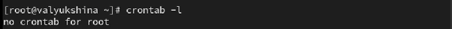!

Откроем файл расписания на редактирование. Добавим следующую строку в файл расписания используя Ins для перехода в vi в режим ввода:
*/1 * * * * logger This message is written from root cron. Это сообщение будет выводиться каждую минуту. Закроем сеанс редактирования vi и сохраним изменения, используя команду vi: Esc : w q.  
!

Посмотрим список заданий в расписании. В расписании появилась запись о запланированном событии.  
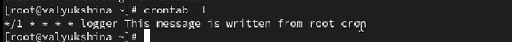!

Не выключая систему, через 3 минуты просмотрим журнал системных событий. Наше сообщение выводилось каждую минуту.  
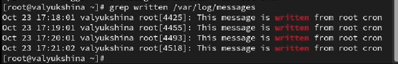!

Изменим запись в расписании crontab на следующую:
0 */1 * * 1-5 logger This message is written from root cron. Сообщение будет выводиться каждый час в ХХ:01.
!

Посмотрим список заданий в расписании.  
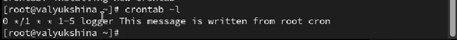!

Перейдем в каталог /etc/cron.hourly и создадим в нём файл сценария с именем eachhour.  
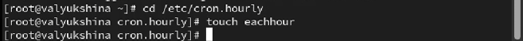!

Откроем файл eachhour для редактирования и пропишем в нём следующий скрипт:  
#!/bin/sh  
logger This message is written at $(date)  
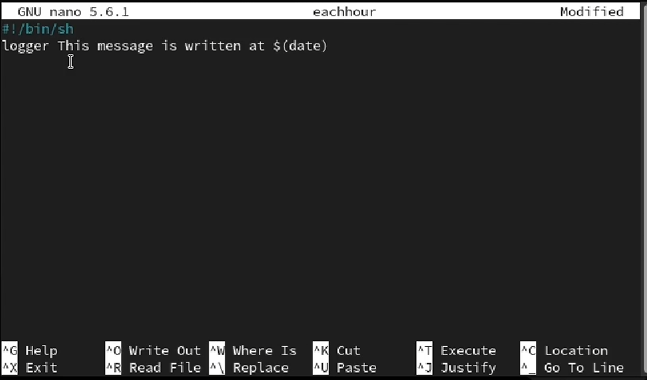!

Сделаем файл сценария eachhour исполняемым.  
!

Теперь перейдем в каталог /etc/crond.d и создадим в нём файл с расписанием eachhour.  
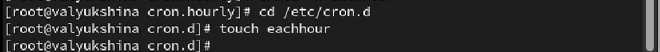!

Откроем этот файл для редактирования и поместим в него следующее содержимое:  
11 * * * * root logger This message is written from /etc/cron.d. Это сообщение будет выводиться каждый час в ХХ:11.  
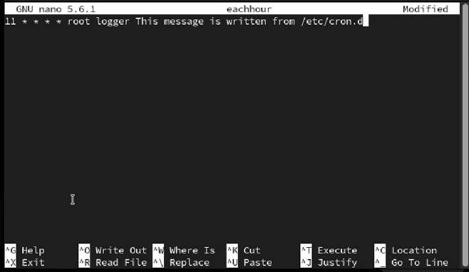!

Не выключая систему, через 3 часа просмотрим журнал системных событий.  
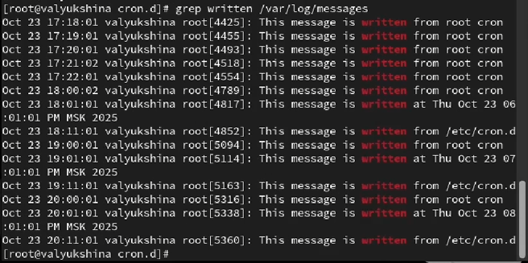!

Проверим, что служба atd загружена и включена.  
!

Зададим выполнение команды logger message from at в 20:50. Затем введем "logger message from at" и закроем оболочку.  
!

Убедимся, что задание действительно запланировано и посмотрим, появилось ли соответствующее сообщение в лог-файле в указанное нами времяю.  
!

# Выводы

В лабораторной работе №8 мы научились планировать задачи в системе, работать со списком задач и временными ограничениями задач.  

# Ответы на контрольные вопросы

1. Как настроить задание cron, чтобы оно выполнялось раз в 2 недели?  

2. Как настроить задание cron, чтобы оно выполнялось 1-го и 15-го числа каждого месяца в 2 часа ночи?  
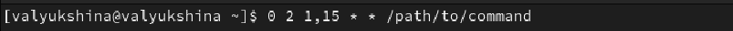

3. Как настроить задание cron, чтобы оно выполнялось каждые 2 минуты каждый день?  
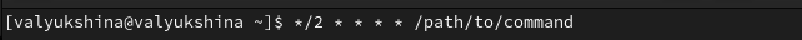

4. Как настроить задание cron, чтобы оно выполнялось 19 сентября ежегодно?  
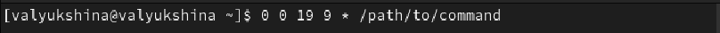

5. Как настроить задание cron, чтобы оно выполнялось каждый четверг сентября ежегодно?  
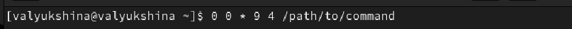

6. Какая команда позволяет вам назначить задание cron для пользователя alice?  
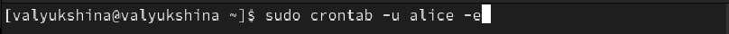

7. Как указать, что пользователю bob никогда не разрешено назначать задания через cron?  
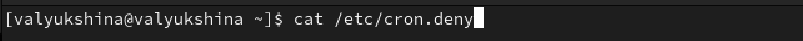

8. Вам нужно убедиться, что задание выполняется каждый день, даже если сервер во время выполнения временно недоступен. Как это сделать?  
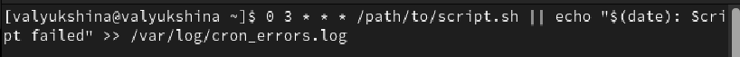

9. Какая команда позволяет узнать, запланированы ли какие-либо задания на выполнение планировщиком atd?  
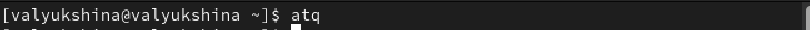

