---
## Author
author:
  name: Люкшина Влада Алексеевна
  email: 112243022@pfur.ru
  affiliation:
    - name: Российский университет дружбы народов
      country: Российская Федерация
      postal-code: 117198
      city: Москва
      address: ул. Миклухо-Маклая, д. 6
## Title
title: Лабораторная работа №9
subtitle: Управление SELinux
date: today
date-format: "YYYY-MM-DD" # Example: 2025-09-06
---

## Цель работы

- Получить навыки работы с контекстом безопасности и политиками SELinux.  

## Задание

1. Продемонстрируйте навыки по управлению режимами SELinux.  
2. Продемонстрируйте навыки по восстановлению контекста безопасности SELinux.  
3. Настройте контекст безопасности для нестандартного расположения файлов веб-службы.  
4. Продемонстрируйте навыки работы с переключателями SELinux.  

## Выполнение лабораторной работы
## Выполнение
- Запустим терминал и получим полномочия администратора. Просмотрим текущую информацию о состоянии SELinux. Как мы видим, система включена и находится в принудительном режиме работы(enforcing).  
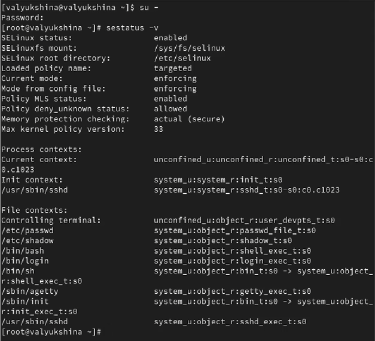!

## Выполнение
- Посмотрим, в каком режиме работает SELinux. Убедимся, что по умолчанию SELinux находится в режиме принудительного исполнения (Enforcing).  
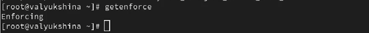!

## Выполнение
- Изменим режим работы SELinux на разрешающий (Permissive) и снова проверим ее режим работы с помощью getenforce.  
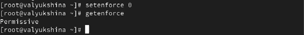!

## Выполнение
- В файле /etc/sysconfig/selinux с помощью редактора установим SELINUX=disabled и перезагрузим систему.  
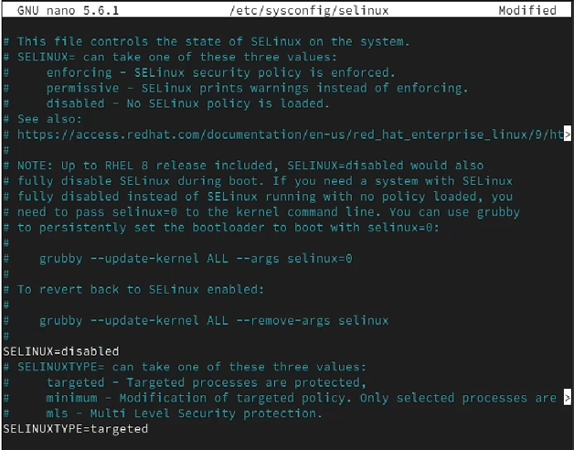!

## Выполнение
- После перезагрузки запустим терминал и получим полномочия администратора. Посмотрим статус SELinux. Как мы видим, SELinux теперь отключён.  
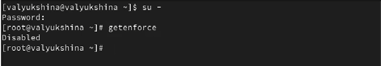!

## Выполнение
- Попробуем переключить режим работы SELinux. Так как SELinux выключен, мы не можем переключаться между отключённым и принудительным режимом без перезагрузки системы.  
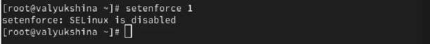!

## Выполнение
- Откроем файл /etc/sysconfig/selinux с помощью редактора и установим SELINUX=enforcing. Перезагрузим систему.  
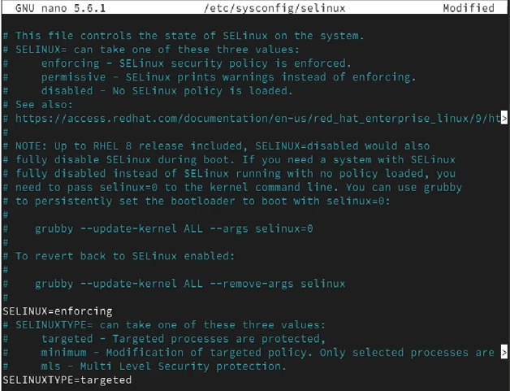!

## Выполнение
- Во время загрузки системы мы получили предупреждающее сообщение о необходимости восстановления меток SELinux, что привело к дополнительной перезагрузке системы.  
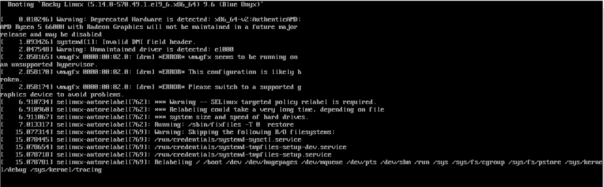!

## Выполнение
- После перезагрузки в терминале с полномочиями администратора просмотрим текущую информацию о состоянии SELinux. Убедимся, что система работает в принудительном режиме (enforcing) использования SELinux.  
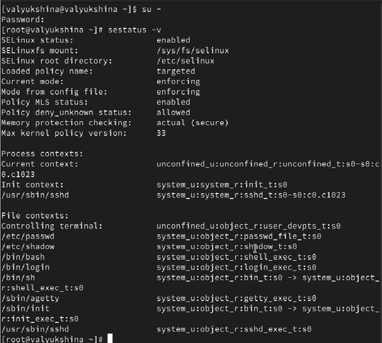!

## Выполнение
- Запустим терминал и получим полномочия администратора. Посмотрим контекст безопасности файла /etc/hosts.Как мы видим, у файла есть метка контекста net_conf_t.  
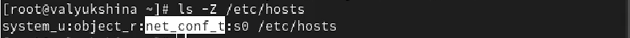!

## Выполнение
- Скопируем файл /etc/hosts в домашний каталог. Проверим контекст файла ~/hosts. Поскольку копирование считается созданием нового файла, то параметр контекста
в файле ~/hosts, расположенном в домашнем каталоге, стал admin_home_t.  
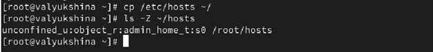!

## Выполнение
- Попытаемся перезаписать существующий файл hosts из домашнего каталога в каталог /etc и подтвердим действие. Убедимся, что тип контекста по-прежнему установлен на admin_home_t.  
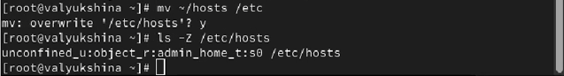!

## Выполнение
- Исправим контекст безопасности. Опция -v покажет процесс изменения. Убедимся, что тип контекста изменился. Для массового исправления контекста безопасности на файловой системе введем touch /.autorelabel и перезагрузим систему.  
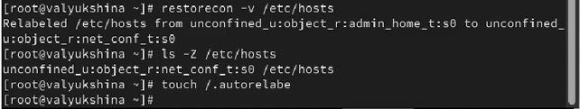!

## Выполнение
- Во время перезапуска нажмем клавишу Esc на клавиатуре и увидим загрузочные сообщения. Файловая
система будет автоматически перемаркирована.  
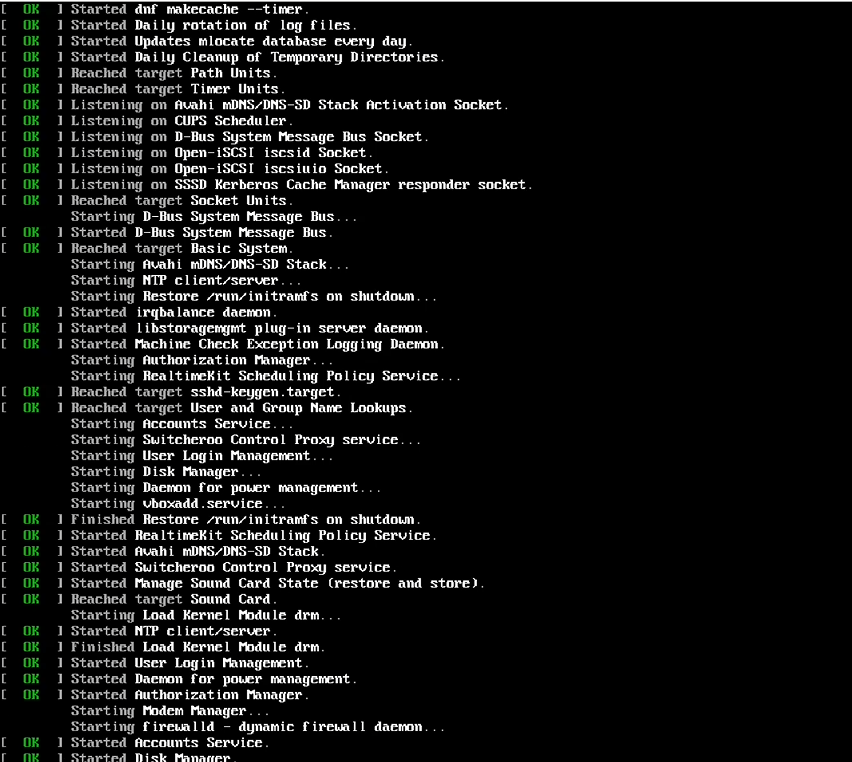!

## Выполнение
- Запустим терминал и получим полномочия администратора. Установим необходимое программное обеспечение.  
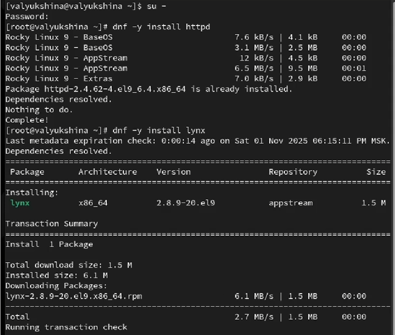!

## Выполнение
- Создайте новое хранилище для файлов web-сервера. Создадим файл index.html в каталоге с контентом веб-сервера.  
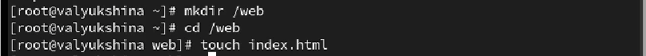!

## Выполнение
- Поместим в файл следующий текст: Welcome to my web-server.  
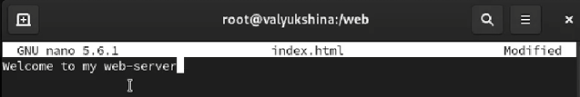!

## Выполнение
- В файле /etc/httpd/conf/httpd.conf закомментируем некоторые строки и ниже добавим другие строки.  
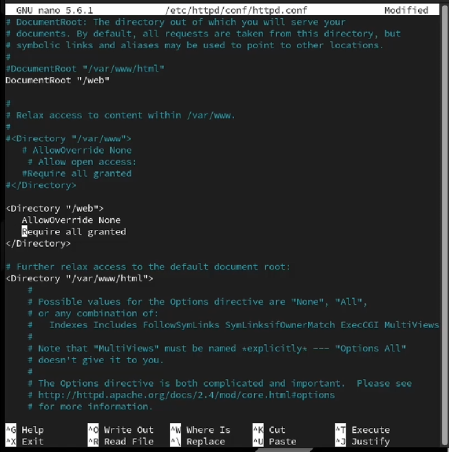!

## Выполнение
- Запустим веб-сервер и службу httpd.  
!

## Выполнение
- В терминале под учётной записью своего пользователя при обращении к веб-серверу мы увидим веб-страницу Red Hat по умолчанию, а не содержимое только что созданного файла index.html. Выйдем из Lynx.  
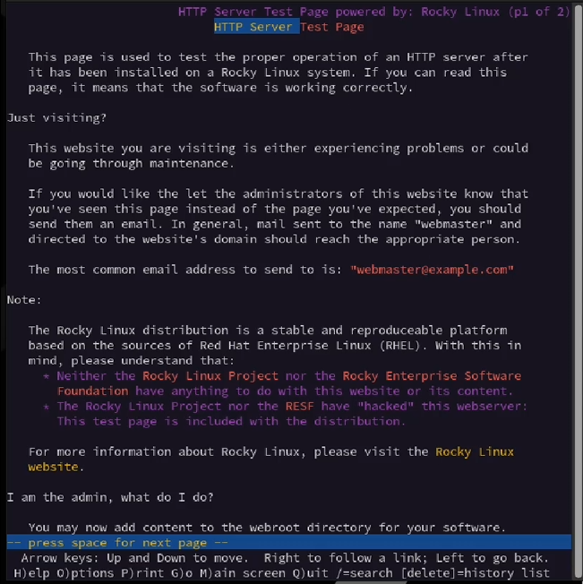!

## Выполнение
- В терминале с полномочиями администратора примените новую метку контекста к /web и восстановим контекст безопасности.  
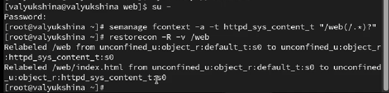!

## Выполнение
- В терминале под учётной записью своего пользователя снова обратимся к веб-серверу. После перезапуска системы мы получили доступ к своей веб-странице.  
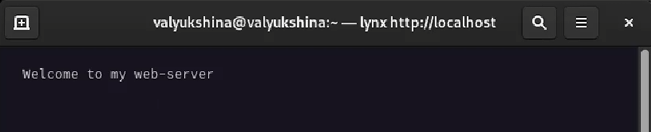!

## Выполнение
- Получим полномочия администратора. Посмотрим список переключателей SELinux для службы ftp. Мы увидим переключатель ftpd_anon_write с текущим значением off. Для службы ftpd_anon посмотрим список переключателей с пояснением, за что отвечает каждый переключатель, включён он или выключен. Переключатель ftpd_anon позволяет анонимно записывать, он выключен.  
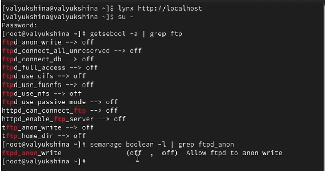!

## Выполнение
- Изменим текущее значение переключателя для службы ftpd_anon_write с off на on. Повторно посмотрим список переключателей SELinux для службы ftpd_anon_write. Посмотрим список переключателей с пояснением. Обратим внимание, что настройка времени выполнения включена, но постоянная настройка по-прежнему отключена.  
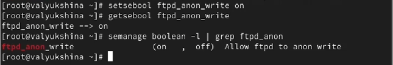!

## Выполнение
- Изменим постоянное значение переключателя для службы ftpd_anon_write с off на on. Посмотрим список переключателей. Как мы видим, теперь значения on, on, т. е. текущее и постоянное значение включено.  
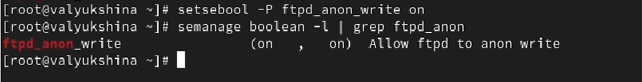!

## Выводы

- В лабораторной работе №9 мы научились работать с SeLinux, а именно менять режимы работы системы, менять контекст, работать с веб-службами.  
