---
## Author
author:
  name: Люкшина Влада Алексеевна
  email: 1132243022@pfur.ru
  affiliation:
    - name: Российский университет дружбы народов
      country: Российская Федерация
      postal-code: 117198
      city: Москва
      address: ул. Миклухо-Маклая, д. 6

## Title
title: "Лабораторная работа № 10"
subtitle: "Основы работы с модулями ядра
операционной системы"
---

# Цель работы

Получить навыки работы с утилитами управления модулями ядра операционной системы.  

# Задание

1. Продемонстрируйте навыки работы по управлению модулями ядра.  
2. Продемонстрируйте навыки работы по загрузке модулей ядра с параметрами.  

# Выполнение лабораторной работы
Запустим терминал и получим полномочия администратора. Посмотрим, какие устройства имеются в нашей системе и какие модули ядра с ними связаны.  
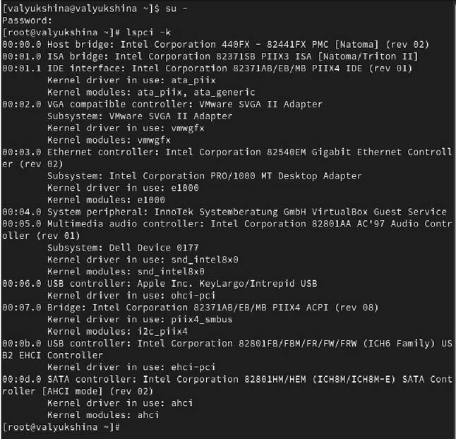!

Посмотрим, какие модули ядра загружены.  
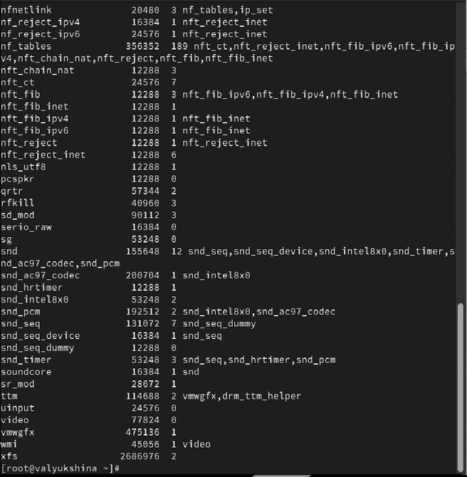!

Посмотрим, загружен ли модуль ext4. Он не загружен, поэтому загружаем модуль ядра ext4.  
!

Убедимся, что модуль загружен, посмотрев список загруженных модулей.  
!

Посмотрим информацию о модуле ядра ext4. Обратим внимание, что у этого модуля нет параметров, только основная информация с именем, авторами, лицензией и т.д.  
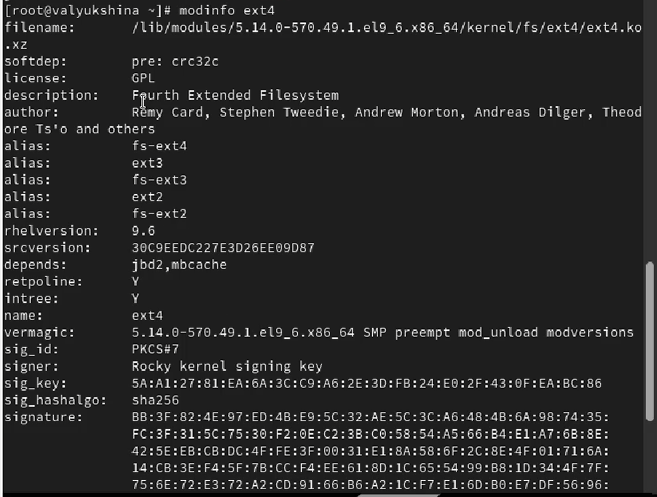!

Попробуем выгрузить модуль ядра ext4. Выводится фатальная ошибка, так как модуль в использовании. Потребуется ввести КОМАНДУ несколько раз.  
!

Попробуем выгрузить модуль ядра xfs. Обратим внимание, что мы получим сообщение об ошибке, поскольку модуль ядра в данный момент используется.  
!

Посмотрим, загружен ли модуль bluetooth. Он не загружен, поэтому загрузим его.  
!

Посмотрим список модулей ядра, отвечающих за работу с Bluetooth.  
!

Посмотрим информацию о модуле bluetooth, помимо основной информации о лицензии, авторах, имени и версии, также есть инфорация о парметрах.  
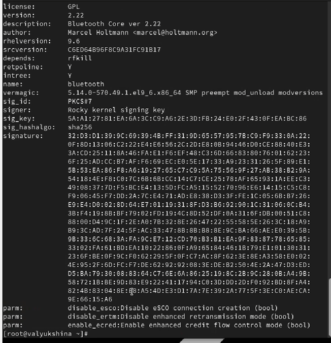!

Выгрузим модуль ядра bluetooth.  
!

Посмотрим версию ядра, используемую в операционной системе.  
!

Выведем на экран список пакетов, относящихся к ядру операционной системы.  
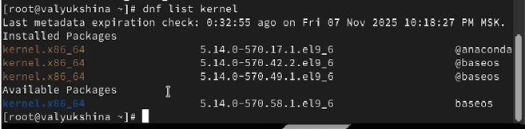!

Обновим систему, чтобы убедиться, что все существующие пакеты обновлены, так как это важно при установке/обновлении ядер Linux и избежания конфликтов.  
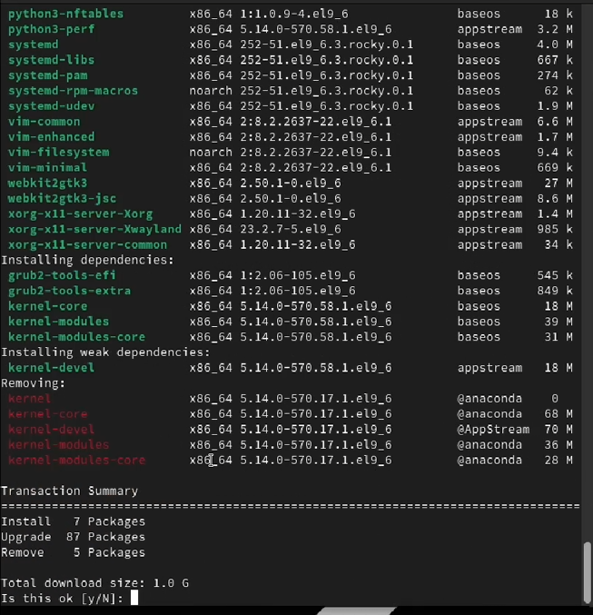!

Обновим ядро операционной системы, а затем саму операционную систему. Перезагрузим систему и выберем новое ядро.  
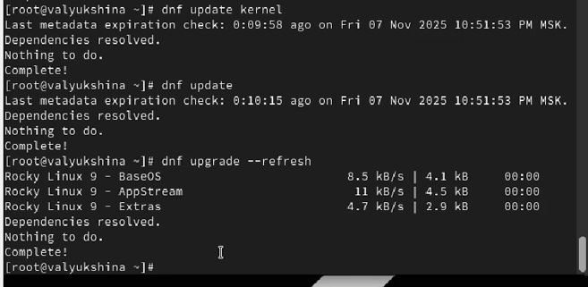!

Посмотрим версию ядра, используемую в операционной системе.  
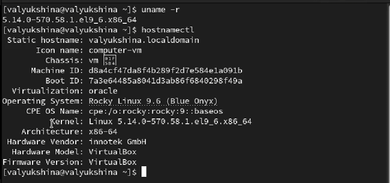!

# Выводы

В лабораторной работе №10 мы научились работать с утилитами управления модулями ядра операционной си-
стемы, выборочно выгружать и управлять ими.  

# Контрольные вопросы
1. Какая команда показывает текущую версию ядра, которая используется на вашей системе?  
!

2. Как можно посмотреть более подробную информацию о текущей версии ядра операционной системы?  
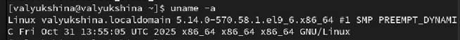!

3. Какая команда показывает список загруженных модулей ядра?  
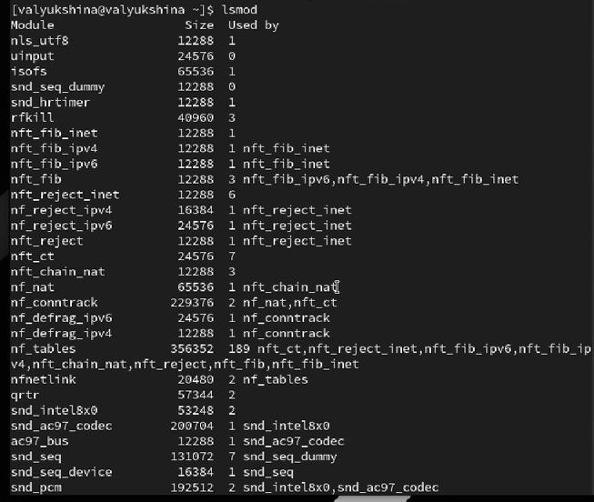!

4. Какая команда позволяет вам определять параметры модуля ядра?  
!

5. Как выгрузить модуль ядра?  
!

6. Что вы можете сделать, если получите сообщение об ошибке при попытке выгрузить модуль ядра?  
!

7. Как определить, какие параметры модуля ядра поддерживаются?  
!

8. Как установить новую версию ядра?  
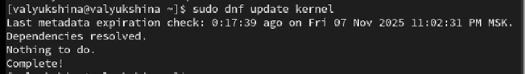!

