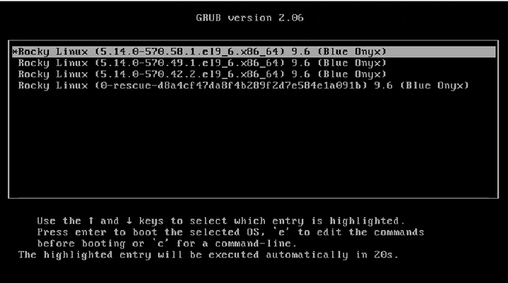
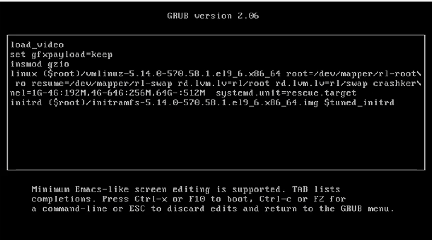
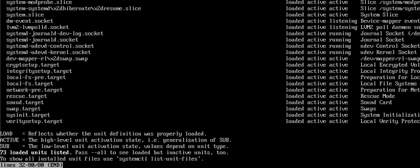
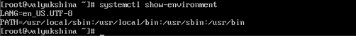
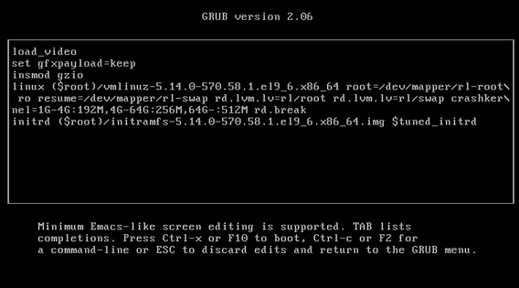
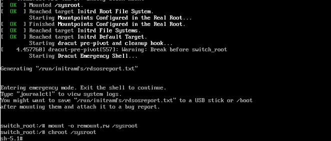
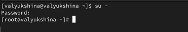

---
## Author
author:
  name: Люкшина Влада Алексеевна
  email: 1132243022@pfur.ru
  affiliation:
    - name: Российский университет дружбы народов
      country: Российская Федерация
      postal-code: 117198
      city: Москва
      address: ул. Миклухо-Маклая, д. 6

## Title
title: "Лабораторная работа № 11"
subtitle: "Управление загрузкой системы"
---

# Цель работы

Получить навыки работы с загрузчиком системы GRUB2.  

# Задание

1. Продемонстрируйте навыки по изменению параметров GRUB и записи изменений в файл конфигурации.  
2. Продемонстрируйте навыки устранения неполадок при работе с GRUB.  
3. Продемонстрируйте навыки работы с GRUB без использования root.  

# Выполнение лабораторной работы

В терминале получаем полномочия администратора. Затем открываем файл /etc/default/grub для редактирования. В файле установливаем параметр GRUB_TIMEOUT=20, увеливая время отображения загрузочного экрана.  
!

Применяем изменения, создаем конфигурационный файл с помощью команды grub2-mkconfig -o /boot/grub2/grub.cfg.  
!

Перезагружаем систему и в процессе загрузки появляется меню GRUB, содержащее несколько записей ядра.  
!

В меню загрузчика GRUB выбираем текущую версию ядра, после чего нажимаем e для перехода в режим редактирования параметров загрузки. В конце строки, начинающейся с linux, был добавляем параметр systemd.unit=rescue.target. Продолжаем загрузку сочетанием клавиш Ctrl + X.  
!

После загрузки в режиме восстановления пишем команду systemctl list-units, которая отображает список активных системных модулей. Как мы видим, активны 73 юнита.  
!

Выполняем команду systemctl show-environment для отображения текущих переменных среды оболочки. Перезагружаем систему.  
!

После перезапуска снова открываем редактор параметров загрузки GRUB. В конце строки ядра добавлен параметр systemd.unit=emergency.target. Продолжаем загрузку.  
!

После входа в систему в режиме emergency смотрим список активных модулей. Как мы видим, в этот раз список состоит из мниималного количества юнитов(53 юнита). Перезагружаем систему.  
!

После перезагрузки опять переходим в режим редактирования. В конце строки ядра добавляем параметр rd.break и продолжаем загрузку.  
!

На этапе initramfs система остановила загрузку. Для получения доступа к файловой введем команду mount -o remount,rw /sysroot. После этого сделаем содержимое каталога /sysimage новым корневым каталогом.  
!

Теперь введем команду задания пароля и установим новый пароль для пользователя root.  
!

Загрузим политику SELinux, чтобы потом успешно войти в систему. Теперь вручную установим правильный тип контекста для /etc/shadow.  
!

Перезагрузим систему с помощью команды reboot -f и войдем в систему с изменённым паролем для пользователя root.  
!

# Выводы

В лабораторной работе №11 мы научились принципам настройки и модификации параметров загрузчика GRUB2, способы перехода в режимы восстановления и экстренной загрузки, а также методы сброса пароля пользователя root.  

# Контрольные вопросы
1. Какой файл конфигурации следует изменить для применения общих изменений в GRUB2?  
!

2. Как называется конфигурационный файл GRUB2, в котором вы применяете изменения для GRUB2?  
!

3. После внесения изменений в конфигурацию GRUB2, какую команду вы должны выполнить, чтобы изменения сохранились и воспринялись при загрузке системы?  
!

